#Linux Bash Shell Cheat Sheet:

System information

| Command                       | Description                                     |     example                    |
|-------------------------------|-------------------------------------------------|--------------------------------|
|      
|arch                           |display architecture                             |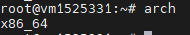    
|uname -m                       |analogue (arch)                                  |    
|uname -r                       |display the kernel version used                  |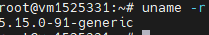 
|dmidecode -q                   |show hardware system components - (SMBIOS \ DMI  |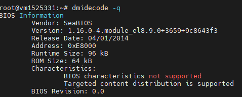
|hdparm -i /dev/sda1            |display hard drive characteristics               |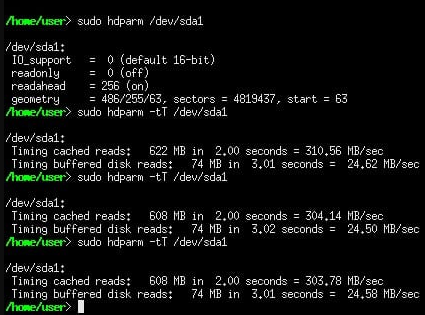
|hdparm -tT /dev/vda2           |test the performance of reading data from the hd |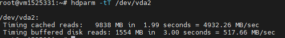
|cat /proc/cpuinfo              |display processor information                    |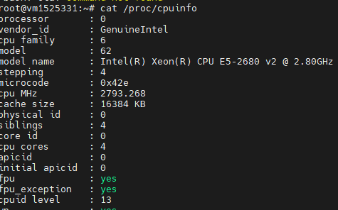
|cat /proc/interrupts           |display interrupts                               |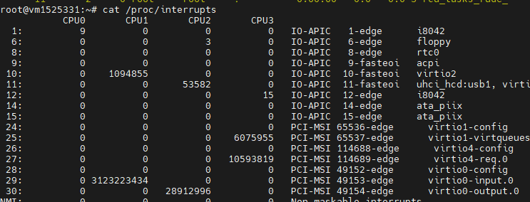
|cat /proc/meminfo              |chek memory usage                                |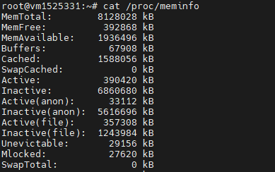
|cat /proc/swaps                |chek swap files                                  |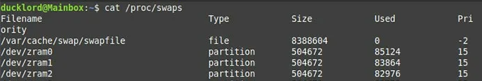
|cat /proc/version              |display kernel version                           |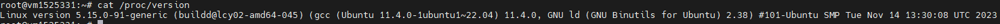
|cat /proc/net/dev              |display network interfaces and statistick on them|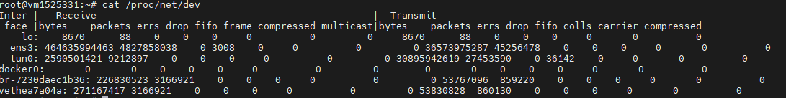
|cat /proc/mounts               |display mounted file systems                     |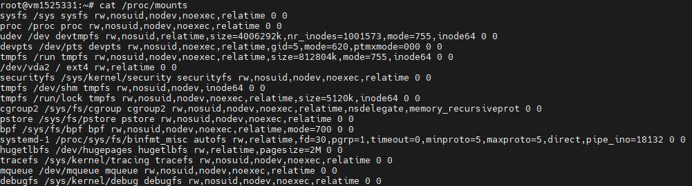                   
|lspci -tv                      |show as a tree of PCI devices                    |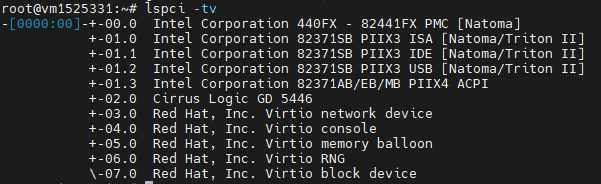               
|lsusb -tv                      |show as a tree of USB devices                    |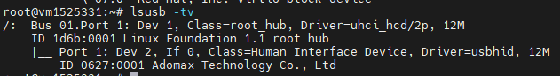               
|date                           |display system date                              |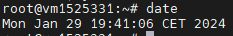|

System shutdown   

| Command                       | Description                                     |     example                    |
|-------------------------------|-------------------------------------------------|--------------------------------|                                                                         
|shutdown -h now                |stop yhe system                                  |               
|init 0                         |stop yhe system                                  |               
|telinit 0                      |stop yhe system                                  |               
|shutdown -h hours:minutes &    |                                                 |               
|shutdown -c                    |                                                 |               
|shutdown -r now                |                                                 |               
|reboot                         |                                                 |     
|logout                         |                                                 |               

Files and directories   

| Command                       | Description                                     |     example                    |
|-------------------------------|-------------------------------------------------|--------------------------------|
|                               |                                                 |               
|                               |                                                 |               
|                               |                                                 |               
|                               |                                                 |               
|                               |                                                 |               
|                               |                                                 |               
|                               |                                                 |         
|                               |                                                 |               
|                               |                                                 |               
|                               |                                                 |               
|                               |                                                 |               
|                               |                                                 |               
|                               |                                                 |               
|                               |                                                 |               
|                               |                                                 |               
|                               |                                                 |               
|                               |                                                 |               
|                               |                                                 |               
|                               |                                                 |               
|                               |                                                 |               
|                               |                                                 |               
|                               |                                                 |               
|                               |                                                 |               
|                               |                                                 |               
|                               |                                                 |               
|                               |                                                 |               
|                               |                                                 |               
|                               |                                                 |               
|                               |                                                 |               
|                               |                                                 |               

